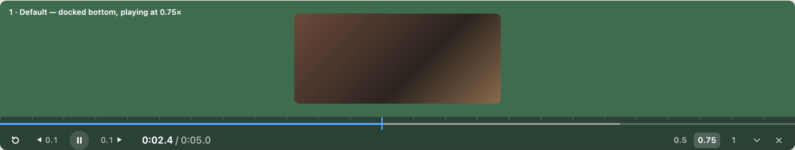

# Media Scrubber

A Chrome extension that gives the audio and video on **any** website one precise,
always-visible control bar — spanning the full width of the window, so the seek
rail has as many pixels as your screen.

Built for short clips (language-learning reels, 2–5 s movie quotes) where site
players have tiny seek bars, controls that hide, and no reliable speed control.
It works the same everywhere: no per-site code.



(Static mockup of all states: [design/bar-mockup.html](design/bar-mockup.html).)

## What it does

- **Full-width seek rail** — click or drag anywhere; the time shows tenths of a
  second while you drag. Hold `Shift` while dragging for 1/10 speed fine
  scrubbing.
- **Step ladder** — `◀` / `▶` (or `←` / `→`) step back and forth. Pressing
  again quickly in the same direction takes bigger steps:
  1 frame (when paused) → 0.1 → 0.2 → 0.5 → 1 → 2 → 5 → 10 → 30 → 60 s.
  The button always shows the size of the next step; short clips never step
  more than a quarter of their length.
- **Speed that sticks** — 0.5 / 0.75 / 1, pitch preserved. The
  chosen speed survives the site resetting it, new clips, replaced elements and
  SPA navigation.
- **Stops at the end of every clip** instead of letting the site auto-advance.
  `Space` continues to the next clip; the site's own "next" button still works.
- **Picks the right media** — follows whatever is playing; with several media
  elements a chip lets you see (outline on the page) and pin the one to control.
  Finds media in shadow DOM (open and closed), detached `new Audio()` and
  iframes, including cross-origin embeds.
- **Never in the way** — dims when idle but never hides by itself; drag it
  vertically (snaps to the top or bottom edge), collapse it to a pill, close it.

## Install (unpacked)

1. Clone this repository.
2. Open `chrome://extensions`, enable **Developer mode**.
3. **Load unpacked** → select the `extension/` folder.

Chrome 120 or newer. No permissions beyond access to pages for the content
scripts; nothing is stored or sent anywhere.

## Use

| Action | How |
|---|---|
| Open / close the bar in this tab | toolbar icon or `Alt+Shift+M` (the icon shows `ON`) |
| Play / pause (at a stopped end: continue) | `Space` or the play button |
| Restart from the beginning | the `↺` button |
| Step back / forward on the ladder | `←` / `→` or `◀` / `▶` (hold to repeat) |
| Seek | click or drag the rail; mouse wheel over the rail = one step |
| Speed | the speed chips |
| Move / dock | drag the empty part of the bar; double-click it to dock at the bottom |

Keys work whenever the bar is open and you are not typing in a field; all
other keys stay with the site. Everything is forgotten on reload.

## Known limits

- When a site makes the `<video>` element itself fullscreen, the bar is shown
  but cannot be clicked (Chrome does not hit-test outside it) — use the keys.
  Container fullscreen (YouTube, most players) works normally.
- Ads are media too: they get the chosen speed and also stop at their end.
- DRM players that break on direct `currentTime` writes, and canvas/WebCodecs
  players without a media element, are not supported.

## How it works

Two content scripts per frame: a small MAIN-world agent that owns the page's
`playbackRate` setter while the bar is open (some players rewrite the rate on
every render) and holds back a site's auto-advance `play()` at the end of a
clip; and an isolated-world controller that holds the user's intent as the
single source of truth and re-applies it to whichever media element is active.
The UI lives in a closed shadow root in the top layer. Details:
[DESIGN.md](DESIGN.md), [UI-DESIGN.md](UI-DESIGN.md),
[docs/contracts.md](docs/contracts.md).

## Development

Plain JavaScript, no build step — `extension/` is what Chrome loads.

Smoke tests (Playwright via [uv](https://docs.astral.sh/uv/); test media is
generated on first run):

```bash
PLAYWRIGHT_BROWSERS_PATH=$HOME/Library/Caches/ms-playwright uv run --with playwright==1.62.0 --with imageio-ffmpeg python test/run.py
```

See [test/README.md](test/README.md) for the local test pages and options.

```
extension/   the extension (manifest, service worker, MAIN agent, content scripts, UI)
test/        Playwright suite, fixture pages, media generator, UI harness
design/      static mockup of the bar states
docs/        internal contracts between subsystems
```
